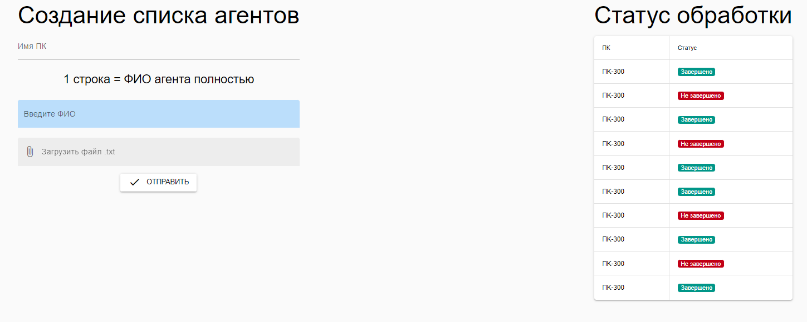
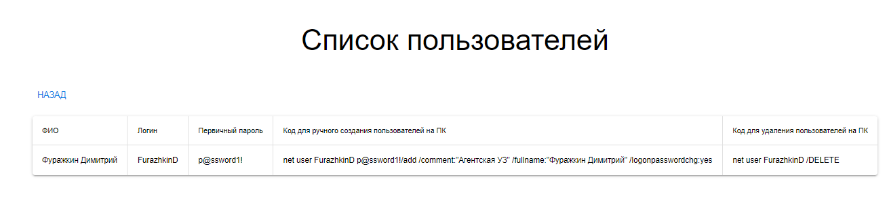
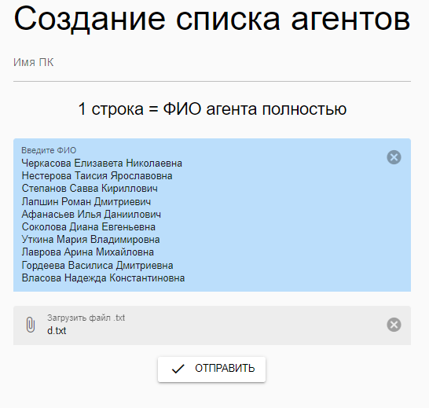
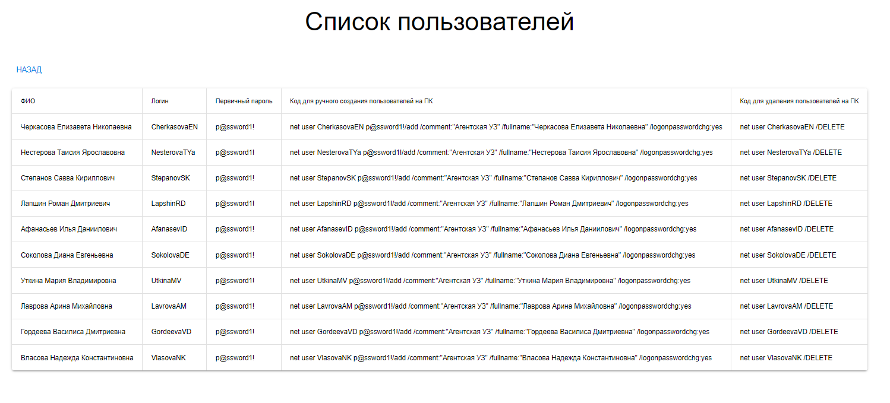

# optimization
Проект интерфейса для создания пользователя, выполненный в рамках практики в компании "Югория"
# Работа
На главной странице находиться форма по для генерации кодов для создания пользователей. Форма имеет валидацию на поле ФИО, это предотвращает ошибки при создании учетной записи. Так же присутствует таблица для ослеживания статуса закрепления пк за агентом, но в рамках проекта доступ к Api не был предоставлен, поэтому она имеет статичный вид.

После заполнения формы идет перенаправление на страницу с генерированным кодами.

# Созадние нескольких пользователей
Также можно создать несколько пользователей загрузив тектовый файл с ФИО или введя их построчно в Форму.

Страница с генерированными кодами:

